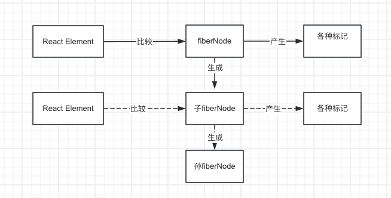
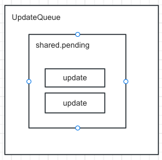
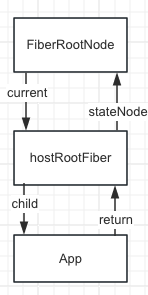
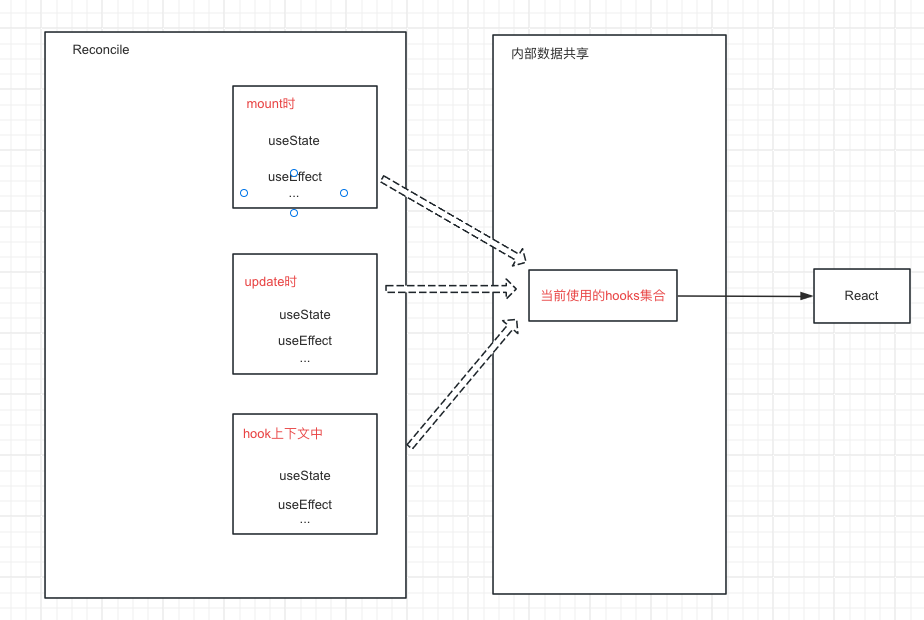
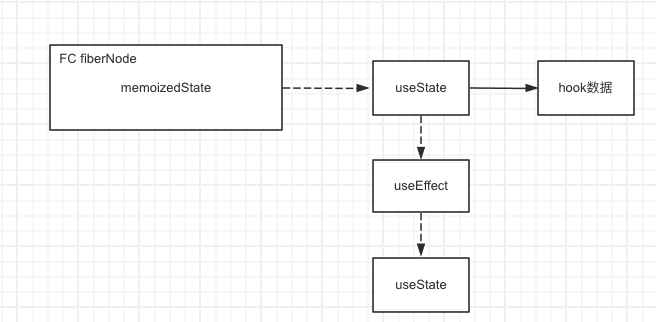
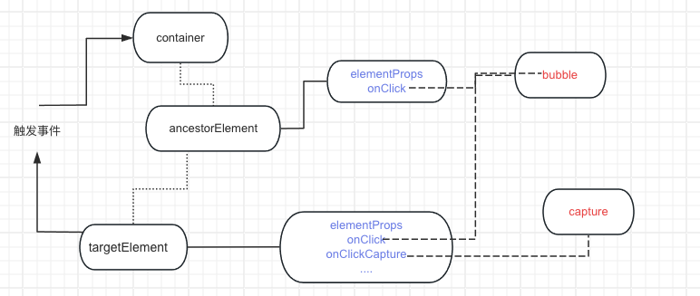

1.使用 menorepo 来管理项目 2.使用 pnpm 来管理依赖
3.pnpm 使用 mororepo 方式来关系项目，需要新建一个 pnpm-workspace.yaml 文件 4.使用项目安装 eslint,`pnpm install eslint -D -w`,-w 的作用的依赖安装的根目录 5.初始化 eslint 配置规则`npx eslint --init`
初始化出来的新配置有点奇怪，最好还是用9.0之前的配置方式

```json
{
	"root": true,
	"extends": ["eslint:recommended", "plugin:@typescript-eslint/recommended"],
	"parser": "@typescript-eslint/parser",
	"parserOptions": {
		"ecmaVersion": "latest",
		"sourceType": "module"
	},
	"plugins": ["@typescript-eslint", "prettier"],
	"rules": {}
}
```

6.安装 typescript 的代码解释，及规则插件`pnpm i @typescript-eslint/parser @typescript-eslint/eslint-plugin` 7.安装 prettier`pnpm i prettier -D -w`,然后新增.prettierrc.json 文件
8.eslint 可能会和 prettier 会有冲突，所以将 prettier 集成到 eslint 中，安装插件`eslint-config-prettier、eslint-plugin-prettier`

> eslint-config-prettier: 是管理 prettier 和 eslint 冲突的规则
> eslint-plugin-prettier: 允许 eslint 用 prettier 格式化代码的能力。 安装依赖并修改.eslintrc 文件

9.commit 规范，使用 husky 10.安装 husky `pnpm i husky -D -w` 11. 初始化 husky `npx husky init` 12.将格式化命令纳入 commit 时 husky 执行的脚本，`echo "pnpm lint" > .husky/pre-commit`

```
husky是对git hooks工作流的一个管理，对husky不懂，可以去看看这篇文章，https://juejin.cn/post/7103889661465985038
```

13.pnpm lint 会对项目所有的内容进行检查，所以添加`lint-staged`库，只对暂存区的内容进行检查。 13.通过`commitlint、@commitlint/cli、@commitlint/config-conventional`，来对提交信息进行检查 14.增加配置文件`.commitlintrc.js`

```js
const Configuration = {
	/*
	 * Resolve and load @commitlint/config-conventional from node_modules.
	 * Referenced packages must be installed
	 */
	extends: ['@commitlint/config-conventional']
};

export default Configuration;
```

15.集成 commitlint 到 husky 中，`echo  'npx --no-install commitlint -e "$1"' > .husky/commit-msg` 16. 增加ts的配置文件`tsconfig.json` 17. packages下增加react文件夹，用来保存react相关内容18. 增加shared文件夹保存公用方法19. 增加script文件夹，并输入rollup配置，用来对内容进行打包
安装rollup

- pnpm i rollup -D -w
  能正常解释commonJs模块，需要安装`@rollup/plugin-commonjs`插件
- pnpm i @rollup/plugin-commonjs -D -w
  正常解释typeScript, 需要安装`rollup-plugin-typescript2`插件
- pnpm i @rollup/plugin-typescript -D -w

  20.书写打包react的rollup配置,及打包命令21. 安装`rollup-plugin-generate-package-json`库，用来打包生成package.json文件22. 新增apps文件夹，并使用create-react-app创建项目，用来管理调试mini-react 23. 为了调试本地的react代码，需要在dist/node_modules/react下执行`pnpm link --global`，链接到全局，然后再到apps/react_demo下执行`pnpm link --global react`,
  将本地包连接使用24. 更新react内容，添加jsxDEV方法25. react-reconciler协调器
  核心模块消费JSX的过程

  核心模块操作的数据结构是？当前已知的数据结构：React Element （JSX转换 playground）

  React Element如果作为核心模块操作 的数据结构，存在的问题：

  ·无法表达节点之间的关系

  ·字段有限，不好拓展（比如：无法表达状态）

  所以，需要一种新的数据结构，他的特点：

  ·介于React Element与真实UI节点之 间

  ·能够表达节点之间的关系

  ·方便拓展（不仅作为数据存储单元，也能作为工作单元）

  这就是FiberNode

  （虚拟DOM在React 中的实现）

  当前我们了解的节点类型：

  ·JSX

  ·React Element

  ·FiberNode

  ·DOM Element

  26reconciler的工作方式

  对于同一个节点，比较其ReactElement与fiberNode(ReactElement中存储着数据，fiberNode中也存储着数据)，生成子

  fiberNode。并根据比较的结果生成不同标记（插入、删除、移动.....），对应不同

  宿主环境API的执行
  

  比如，挂载`<div></div>`

```html
// React Element
<div></div>
jsx("div") /／对应fiberNode null ／／ 生成子fiberNode ／／对应标记 Placement
```

将`<div></div>`更新为`<p></p>`

```html
// React Element
<p></p>
jsx("p") /／对应fiberNode FiberNode {type: 'diev'} ／／ 生成子fiberNode
／／对应标记 Deletion Placement
```

当所有React Element比较完后，会生 成一棵fiberNode树，一共会存在两棵fiberNode树：

·current：与视图中真实UI对应的fiberNode树

·workInProgress：触发更新后，正 在reconciler中计算的fiberNode树
<b>双缓冲技术介绍</b>
JSX消费的顺序
DFS深度优先遍历与BFS广度优先遍历详解
以DFS（深度优先遍历）的顺序遍历React Element，这意味着：
·如果有子节点，遍历子节点
·如果没有子节点，遍历兄弟节点
以DFS（深度优先遍历）的顺序遍历React Element，这意味着：

```html
<Card>
	＜h3＞你好</h3＞
	<p>Big-React</p>
</Card>
```

这是个递归的过程，存在递、归两个阶段：

·递：对应beginWork

·归：对应completeWork

## <b>如何触发更新</b>

常见的触发更新的方式：

·ReactDOM.createRoot().render （或老版的ReactDOM.render）

·this.setState

·useState的dispatch方法

我们希望实现一套统一的更新机制，他的特点是：

·兼容上述触发更新的方式

·方便后续扩展（优先级机制...）更新机制的组成部分

·代表更新的数据结构——Update

·消费update的数据结构——

UpdateQueue


接下来的工作包括：

·实现mount时调用的API

·将该API接入上述更新机制中需要考虑的事情：

·更新可能发生于任意组件，而更新流程是从根节点递归的

·需要一个统一的根节点保存通用信息

```js
// 比如
React.createRoot(rootElement).render(<App />);
```



# 为什么hostConfig.ts需要在tsconfig.json中进行配置路径，而不是直接通过相对路径进行文件引入呢？

> 因为React是可以用在非浏览器的宿主环境的，每个环境的hostConfig内容都不一样，如果用相对路径，则限定死了hostConfig的文件内容

## 初探mount流程

更新流程的目的：

·生成wip fiberNode树

·标记副作用flags

更新流程的步骤：

·递：beginWork

·归：completeWork beginWork

对于如下结构的reactElement：

```HTML
<A>
	<B></B>
</A>
```

当进入A的beginWork时，通过对比B current fiberNode与B reactElement， 生成B对应wip fiberNode.
在此过程中最多会标记2类与「结构变化」相关的flags：
·Placement
插入：a-＞ab 移动：abc -＞ bca
·ChildDeletion
:ul>li*3->ul>li*1
不包含与「属性变化」相关的flag：Update

＜img title＝＂鸡＂／＞ -＞ ＜img title＝＂你太 美＂＞
实现与Host相关节点的beginWork

首先，为开发环境增加＿DEV＿标识，方便Dev包打印更多信息：

```sh
pnpm i @rollup/plugin-replace -D -w
```

HostRoot的beginWork工作流程：
1．计算状态的最新值

2．创造子fiberNode

HostComponent的beginWork工作流 程：

1．创造子fiberNode

HostText没有beginWork工作流程

（因 为他没有子节点）

```HTML
<p>唱跳rap</p>
```

#### beginWork性能优化策略

考虑如下结构的reactElement：

```html
<div>
	<p>练习时长</p>
	<span>两年半</span>
</div>
```

理论上mount流程完毕后包含的flags：

·两年半 Placement

·span Placement

·练习时长 Placement

·p Placement

·div Placement

相比于执行5次Placment，我们可以构建好「离屏DOM树」后，对div执行1次Placement操作

completeWork 需要解决的问题：

·对于Host类型fiberNode：构建离屏 DOM树
标记Update flag(todo)

#### completeWork

需要解决的问题：

对于Host类型fiberNode：构建离屏DOM树

标记Update flag （TODO）

completeWork性能优化策略

flags分布在不同fiberNode中，如何快速找到他们？

答案：利用completeWork向上遍历（归）的流程，将子fiberNode的flags冒泡到父fiberNode

### 第六课 初探ReactDOM

react内部3个阶段：

·schedule阶段

·render阶段（beginWork completeWork）

·commit阶段（commitWork）

commit阶段的3个子阶段

·beforeMutation阶段

·mutation阶段

·layout阶段

当前commit阶段要执行的任务1．fiber树的切换

2．执行Placement对应操作

需要注意的问题，考虑如下JSX，如果span含有flag，该如何找到它：

```html
<App>
	<div>
		<span>只因</span>
	</div>
</App>
```

打包ReactDOM 需要注意的虚：

·兼容原版React的导出

> react-dom需要打包出两个文件，一个是index.js，一个是client.js
> ·处理hostConfig的指向
> tsconfig.json配置hostConfig的路径，只是用于ts的类型检查
> 打包时，rollup不知道hostConfig的路径，所以需要通过插件`@rollup/plugin-alias`来进行配置

### 第七课 初探FC与实现

第二种调试方式 FunctionComponent需要考虑的问题：

·如何支持FC？

·如何组织Hooks？（下一节课讲解）如何支持FC？

FC的工作同样植根于：

·beginWork

·completeWork 第二种调试方式

采用vite的实时调试，他的好处是「实时看到源码运行效果」。

### 第八课 实现useState

hook脱离FC上下文，仅仅是普通函数，如何让他拥有感知上下文环境的能力？

比如说：

- hook如何知道在另一个hook的上下文环境内执行？

```tsx
function App() {
	useEffect(() => {
		// 执行useState时怎么
		useState(8);
	});
}
```

- hook怎么知道当前是mount还是update？
  解决方案：在不同上下文中调用的hook不是同一个函数。
  > 不同的阶段，有不同hooks的集合
  > 

实现「内部数据共享层」时的注意事项：
以浏览器举例，Recgnciler＋hostConfig＝ ReactDOM

增加「内部数据共享层」，意味着Reconciler与React产生关联，进而意味着ReactDOM与React 产生关联。

如果两个包「产生关联」，在打包时需要考虑：两者的代码是打包在一起还是分开？

如果打包在一起，意味着打包后的ReactDOM中会包含React的代码，那么ReactDOM中会包含 一个内部数据共享层，React中也会包含一个内部数据共享层，这两者不是同一个内部数据共享层。

而我们希望两者共享数据，所以不希望ReactDOM中会包含React的代码，所以需要在react-dom.config.js中增加external外部包的配置

- hook如何知道自身数据保存在哪里

```ts
function App() {
	// 执行useState为什么能正常返回num
	const [num] = useState(0);
}
```

答案：可以记录正在render的FC对应的fiberNode，在fiberNode中保存hook数据

> 面试题：为什么react中强调hook的在不同更新的时候调用顺序不能变？
> 因为hook的数据是保存在一个链表中的，所以调用顺序要保持一致，才能通过memoizedState取到对应hook的正确的数据
> 
> fc的fiberNode的memoizedState属性对应hook的调用链表，然后每个hook的hook数据中又有一个memoizedState用来记录当前hook的数据
> 对于FC对应的fiberNode，存在两层数据：

·fiberNode.memoizedState对应Hooks链表

·链表中每个hook对应自身的数据

实现useState 包括2方面工作：

1．实现mount时useState的实现

2．实现dispatch方法，并接入现有更新流程内

### 第九课 ReactElement测试用例

本节课我们将实现第三种调试方式——用例调

试，包括三部分内容：

·实现第一个测试工具test—utils

·实现测试环境

·实现ReactElement用例

与测试相关的代码都来自React仓库，可以先把React仓库下载下来：

```sh
git clone git@github.com:facebook/react 实现test-utils
```

这是用于测试的工具集，来源自

`ReactTestUtils.js`，特点是：使用ReactDOM作为 宿主环境

题外话：有没有其他测试工具？
实现测试环境

```sh
pnpm i -D -w jest jest-config jest-environment-jsdom
```

为jest增加解释JSX的能力，安装Babel

```sh
pnpm i -D -w @babel/core @babel/preset-env  @babel/plugin-transform-react-jsx
```

新增babel.config.js

```js
module.exports = {
	presets: ['@babel/preset-env'],
	plugins: [['@babel/plugin-transform-react-jsx', {throwIfNamespace: false}]]
};
```

### 第10课 初探update流程

update流程与mount流程的区别。 对于beginWork：

·需要处理ChildDeletion的情况

·需要处理节点移动的情况（abc—＞bca）对于completeWork：

·需要处理HostText内容更新的情况

·需要处理HostComponent属性变化的情况 对于commitWork：

·对于ChildDeletion，需要遍历被删除的子树 对于useState：

·实现相对于mountState的updateState

##### beginWork流程

本节课仅处理单一节点，所以省去了「节点移动」的情况。我们需要处理：

·singleElement

·singleTextNode 处理流程为：

1．比较是否可以复用current fiber

a.比较key，如果key不同，不能复用
b.比较type，如果type不同，不能复用

c.如果key与type都相同，则可复用

2．不能复用，则创建新的（同mount流程），可以复用则复用旧的

注意：对于同一个fiberNode，即使反复更新，current、wip这两个fiberNode会重复使用

·completeWork流程

主要处理「标记Update」的情况，本节课我们处理HostText内容更新的情况。

commitWork流程

对于标记ChildDeletion的子树，由于子树中：

·对于FC，需要处理useEffect unmout执行、 解绑ref

·对于HostComponent，需要解绑ref

·对于子树的「根HostComponent」，需要移 除DOM

所以需要实现「遍历ChildDeletion子树」的流程

对于useState

需要实现：

·针对update时的dispatcher

·实现对标mountWorkInProgresHook的 updateWorklnProgresHook

·实现updateState中「计算新state的逻辑」 其中updateWorkinProgresHook的实现需要考虑

- hook数据从哪里来?
  从current hook中来
- 交互阶段触发的更新

```HTML
<div onClick={()=> update(1)}></div>
```

- render阶段触发的更新

```tsx
function App() {
	const [num, setNum] = useState();
	//触发更新
	return <div>{num}</div>;
}
```
### 第11课实现事件系统

事件系统本质上植根于浏览器事件模型，所以他隶属于ReactDOM,在实现时要做到对Reconciler 0侵入。

实现事件系统需要考虑：

- 模拟实现浏览器事件捕获、冒泡流程
- 实现合成事件对象
- 方便后续扩展

##### 实现ReactDOM与Reconciler对接

将事件回调保存在DOM中，通过以下两个时机对接：
- 创建DOM时

- 更新属性时

模拟实现浏览器事件流程
